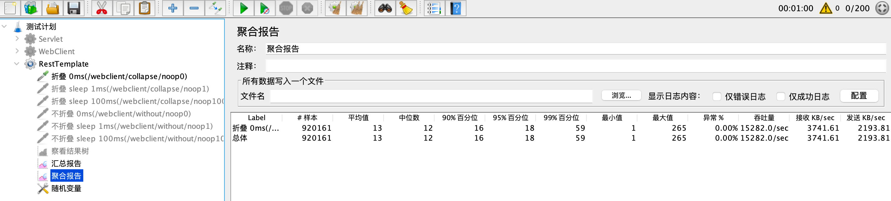
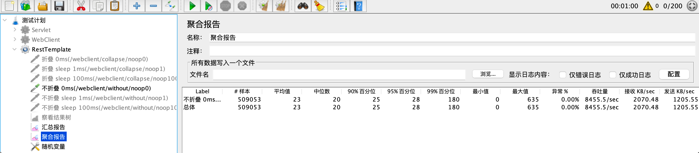
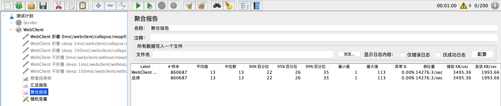
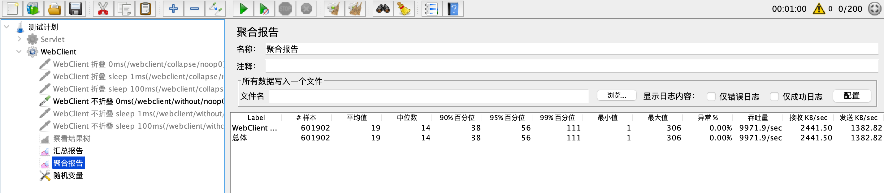

# 项目简介

collapse executor 是一个高性能、低延迟的批量执行器，可有效支持高并发的热点请求，支持与Spring Boot集成，帮助开发者快速构建高性能的微服务，提高服务资源利用率的同时降低服务响应时间。涉及技术点包括CompletableFuture、Spring Boot、WebClient、Servlet Async等主流技术栈

# 适用场景
1. 部分接口的并发量很高，想提升性能的同时又不希望引入缓存服务，减少额外维护成本。
2. 单次调用转批量调用。在同一时刻将不同线程的参数合并为一个参数再执行批处理逻辑。
3. 希望降低客户端的远程连接数量。
4. 希望减少服务端工作线程消耗。
5. 批量获取基于DB/redis的自增序列

# 项目亮点

1. API简单易上手，扩展难度低

> 默认提供了`spring-boot`集成，可在spring-boot环境下开箱即用。且核心逻辑已高度抽象，二次扩展实现简单，仅需编写`合并请求`以及`拆分响应`两块逻辑。

2. 高性能0延迟，发起批量请求时无需等待时间窗口

> 巧妙的利用了`提交任务->任务执行`两个行为之间的时间间隔进行输入的批量收集，相比于`等待一个时间窗口(如等待2ms)`
> 的设计，该设计可在批处理下依然保证极高的实时性，且在高并发的场景下也有着不俗的批量收集能力。

3. 设计简单易维护，无需维护第三方服务

> 核心逻辑完全不依赖任何第三方库/服务，完全基于JDK库进行实现。

# 流程对比

以下两张图解释了有无折叠执行器的调用差异。当无请求折叠时，请求与网络连接数的比例为1:1；当使用请求折叠后，请求与网络连接数的比例为N:1，即多个请求会合并为一个请求发起远程调用，由此可以做到减少I/O次数、减少后端压力，从而提升调用性能降低RT。

### 无请求折叠


### 有请求折叠


# 快速开始

`必备条件: JDK8及以上`

## 一.入门: 自动折叠及拆分

该方式适用于简单的`幂等请求`的场景，通常需要用户手动指定本次调用所属的并发分组。
> 以下该案例表示将当前传入的Callable按照 `example group` 进行分组。
> 同一并发分组下的Callable仅执行一次，并将这一次的返回结果作为同一并发分组发起的请求结果

### 1.同步阻塞调用

[BlockingCollapseExecutorExample.java](./collapse-executor-samples/collapse-executor-sample-simple/src/main/java/cn/icodening/collapse/sample/simple/BlockingCollapseExecutorExample.java)

````java
public class BlockingCollapseExecutorExample {

    public static void main(String[] args) throws Throwable {
        SuspendableCollector suspendableCollector = new SuspendableCollector();
        BlockingCallableGroupCollapseExecutor blockingCollapseExecutor = new BlockingCallableGroupCollapseExecutor(suspendableCollector);
        String outputString = blockingCollapseExecutor.execute("example group", () -> "Hello World Collapse Executor. Blocking");
        System.out.println(outputString);
    }
}
````

### 2.异步调用

[AsyncCollapseExecutorExample.java](./collapse-executor-samples/collapse-executor-sample-simple/src/main/java/cn/icodening/collapse/sample/simple/AsyncCollapseExecutorExample.java)

````java
public class AsyncCollapseExecutorExample {

    public static void main(String[] args) throws Throwable {
        SuspendableCollector suspendableCollector = new SuspendableCollector();
        AsyncCallableGroupCollapseExecutor asyncCallableGroupCollapseExecutor = new AsyncCallableGroupCollapseExecutor(suspendableCollector);
        asyncCallableGroupCollapseExecutor.setExecutor(new ThreadPoolExecutor(10, 10, 0, TimeUnit.MILLISECONDS, new LinkedBlockingQueue<>(), r -> {
            Thread thread = new Thread(r);
            thread.setDaemon(true);
            return thread;
        }));
        asyncCallableGroupCollapseExecutor.execute("example group", () -> "Hello World Collapse Executor. Async")
                .thenAccept(System.out::println)
                .thenRun(() -> System.exit(0));
        System.in.read();
    }
}
````

### 3.非阻塞异步调用

[FutureCollapseExecutorExample.java](./collapse-executor-samples/collapse-executor-sample-simple/src/main/java/cn/icodening/collapse/sample/simple/FutureCollapseExecutorExample.java)
> 这种方式必须保证Callable中的处理逻辑是非阻塞的！！！

````java
public class FutureCollapseExecutorExample {

    public static void main(String[] args) throws Throwable {
        SuspendableCollector suspendableCollector = new SuspendableCollector();
        FutureCallableGroupCollapseExecutor futureCollapseExecutor = new FutureCallableGroupCollapseExecutor(suspendableCollector);
        futureCollapseExecutor.execute("example group", () -> CompletableFuture.completedFuture("Hello World Collapse Executor. Future"))
                .thenAccept(System.out::println)
                .thenRun(() -> System.exit(0));
        System.in.read();
    }
}
````

## 二. 进阶: 手动折叠及拆分

该方式适用于后端服务提供了批处理接口的场景，将同并发下其他线程的输入合并调用后端服务的批处理接口，可以减少多次不必要的单次调用，如批量查询。  
由于这种方式可以更好的处理输入组，故该方式合并效率可以更高，由此带来的性能提升也会更高。

### 1.同步阻塞调用

[CustomBlockingCollapseExecutor.java](./collapse-executor-samples/collapse-executor-sample-advanced/src/main/java/cn/icodening/collapse/sample/advanced/support/CustomBlockingCollapseExecutor.java)

````java
public class CustomBlockingCollapseExecutor extends CollapseExecutorBlockingSupport<Long, UserEntity, Map<Long, UserEntity>> {
    @Override
    protected Map<Long, UserEntity> doExecute(Collection<Input<Long>> inputs) {
        //此处编写批量请求逻辑
        return null;
    }

    @Override
    protected void bindingOutput(Map<Long, UserEntity> users, List<Bundle<Long, UserEntity>> bundles) {
        //此处编写批量响应与原始请求关联的逻辑
    }
}
````

### 2.异步调用

[CustomAsyncCollapseExecutor.java](./collapse-executor-samples/collapse-executor-sample-advanced/src/main/java/cn/icodening/collapse/sample/advanced/support/CustomAsyncCollapseExecutor.java)  
与同步阻塞调用类似，主要差异为需要设置一个`异步线程池`，用于执行批量请求逻辑。

````java
public class CustomBlockingCollapseExecutor extends CollapseExecutorAsyncSupport<Long, UserEntity, Map<Long, UserEntity>> {
    @Override
    protected Map<Long, UserEntity> doExecute(Collection<Input<Long>> inputs) {
        //此处编写批量请求逻辑
        return null;
    }

    @Override
    protected void bindingOutput(Map<Long, UserEntity> users, List<Bundle<Long, CompletableFuture<UserEntity>>> bundles) {
        for (Bundle<Long, CompletableFuture<UserEntity>> bundle : bundles) {
            Long inputId = bundle.getInput();
            UserEntity userEntity = users.get(inputId);
            //需要返回CompletableFuture类型
            bundle.bindOutput(CompletableFuture.completedFuture(userEntity));
        }
    }
}
````

## 三. Spring Boot集成
collapse executor已经对Spring Boot进行了适配，利用Spring Boot自动装配能力简化了在Spring环境下的使用体验，通过简单的配置即可使用。  
在Spring Boot中，collapse executor对主要的几个组件进行了适配，分别是
[RestTemplate](./collapse-executor-integration/collapse-executor-spring-web/src/main/java/cn/icodening/collapse/spring/web/client/CollapseHttpRequestInterceptor.java)
、[WebClient](./collapse-executor-integration/collapse-executor-spring-web/src/main/java/cn/icodening/collapse/spring/web/client/reactive/CollapseExchangeFilterFunction.java)
、[Servlet](./collapse-executor-integration/collapse-executor-spring-web/src/main/java/cn/icodening/collapse/spring/web/server/CollapseHttpRequestServletFilter.java)。
## 1. application.yaml配置解释
以下是一个折叠执行器的yaml配置例子及解释，详情可参考`collapse-executor-sample-spring-boot`中的[application.yaml](./collapse-executor-samples/collapse-executor-sample-spring-boot/src/main/resources/application.yaml)
````yaml
collapse:
  executor:
    enabled: true # 折叠执行器的总开关，配置为false后，后面的所有配置(servlet、rest-template、web-client)将失效
    wait-threshold: 10 #批量收集的最小阈值
    collecting-wait-time: 0 #声明批量收集未达到阈值时的行为。
      #collecting-wait-time < 0时：不做任何等待，立即发起调用
      #collecting-wait-time = 0时：让出当前收集线程时间片等待下次调度后再发起调用
      #collecting-wait-time > 0时：等待指定的时间后再发起调用，单位为毫秒(ms)
    rest-template:
      enabled: true #true表示打开RestTemplate的合并拦截器
      collapse-policies:
        #声明合并策略，可以配置多个
        sample-policy1: #策略名字
          collapse-request-headers: #声明需要合并的请求头名字
            - authorization
          collapse-request-queries: #声明需要合并的查询参数名字
            - sample
        sample-policy2:
          collapse-request-headers:
            - user-id
          collapse-request-queries:
            - sample
      collapse-groups:
        # collapse-policy-name可以省略，省略后使用默认策略仅合并path相同的请求，而忽略其他任何参数
        # 例如：此时并发发起 /user/2、/user/2、/article/2、/article/2    [4]个请求，由于前两个请求满足 /user/*，则会将前两个合并为 [1] 个请求发起调用；
        #  而第三第四个/article/2请求没有匹配到配置中的声明的折叠组，则依然会按照 [2] 个请求分别发起调用
        - uris:
            - /user/*
            - /test/noop*
        #------------------------------------------------------------------
        
        # 例如：此时并发发起 /samples/1(header:authorization=test), /samples/1(header:authorization=test), /samples/1(header:authorization=demo)   [3]个请求，
        #  由于前两个请求携带的[authorization]请求头值相同，则会将前两个合并为 [1] 个请求发起调用；
        #  而第三个请求则会单独发起调用，与前两个不是同一组!
        - collapse-policy-name: sample-policy1 #需要与前面声明的策略名对应
          uris:
            - /samples/*
````
## 2. 启动[SpringBootSampleApplication](./collapse-executor-samples/collapse-executor-sample-spring-boot/src/main/java/cn/icodening/collapse/sample/spring/boot/SpringBootSampleApplication.java)查看结果
业务逻辑位于
[AbstractBlockingCallSample](./collapse-executor-samples/collapse-executor-sample-spring-boot/src/main/java/cn/icodening/collapse/sample/spring/boot/service/AbstractBlockingCallSample.java)
````java
public abstract class AbstractBlockingCallSample {
    //已省略前后无关代码
    @EventListener(ApplicationReadyEvent.class)
    public void processOnStarted() {
        UriComponentsBuilder baseUriBuilder = UriComponentsBuilder.fromUriString("http://localhost").port(serverPort);
        try {
            System.out.println("--------------------------------[" + prefix + "] start----------------------------------");
            //查询id为1-50之间的所有用户，预期打印结果为执行了50次
            queryId1between50(executorService, baseUriBuilder);

            //批处理查询id为1-50之间的所有用户，预期打印结果小于50次
            queryId1between50Batch();

            //单条查询id为1-2之间的所有用户，预期打印结果小于50次
            queryId1between2(executorService, baseUriBuilder);
            System.out.println("--------------------------------[" + prefix + "] end------------------------------------\n\n\n");
        } catch (InterruptedException e) {
            throw new RuntimeException(e);
        }
    }
}
````
# 性能对比
## 一、Servlet
> 结论：相比于未使用折叠，TPS提升高达`94%`  
```` text
服务参数
server.tomcat.threads.max=200

服务地址(位于 collapse-executor-samples 中的 StressTestController, 后端均延迟[100ms]后响应，逻辑一致无差异)
http://localhost:8080/test/collapse100
http://localhost:8080/test/noop100

测试参数
400用户线程数，持续压测5分钟
````

### 开启折叠

```` text
http://localhost:8080/test/collapse100 启用请求折叠测试结果
TPS   3785/s
RT99  115ms
````


## 关闭折叠

```` text
http://localhost:8080/test/noop100 关闭请求折叠测试结果
TPS   1951/s
RT99  211ms
````


## 二、RestTemplate
> 结论：相比于未使用折叠，TPS提升高达`80%`
```` text
RestTemplate默认配置，差异仅为是否包含折叠执行拦截器(CollapseHttpRequestInterceptor)
RestTemplate调用地址http://localhost:8080/test/noop0
200用户线程数，持续压测1分钟
````
### 开启折叠
```` text
启用请求折叠测试结果
TPS   15282/s
RT99  59ms
````


### 关闭折叠
```` text
启用请求折叠测试结果
TPS   8455/s
RT99  180ms
````


## 三、WebClient
> 结论：相比于未使用折叠，TPS提升高达`43%`
```` text
WebClient默认配置，差异仅为是否包含折叠执行拦截器(CollapseExchangeFilterFunction)
WebClient调用地址http://localhost:8080/test/noop0
200用户线程数，持续压测1分钟
````
### 开启折叠
```` text
启用请求折叠测试结果
TPS   14276/s
RT99  35ms
````


### 关闭折叠
```` text
启用请求折叠测试结果
TPS   9971/s
RT99  111ms
````



# 工作流程

