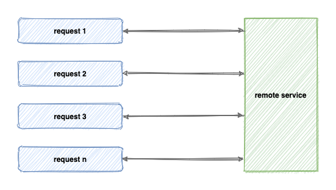
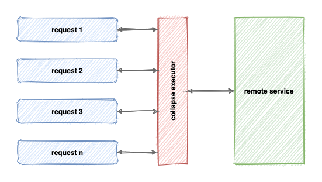
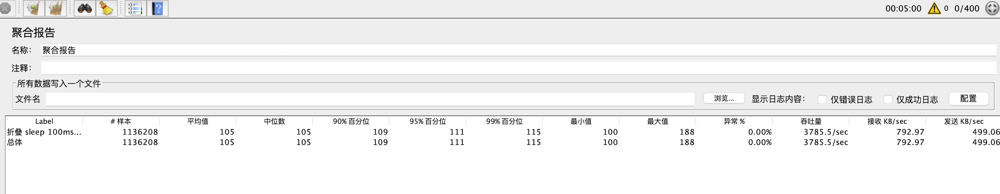
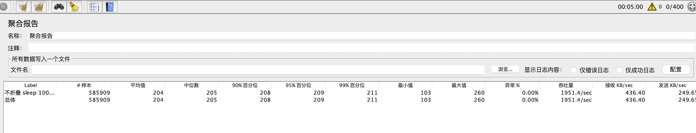
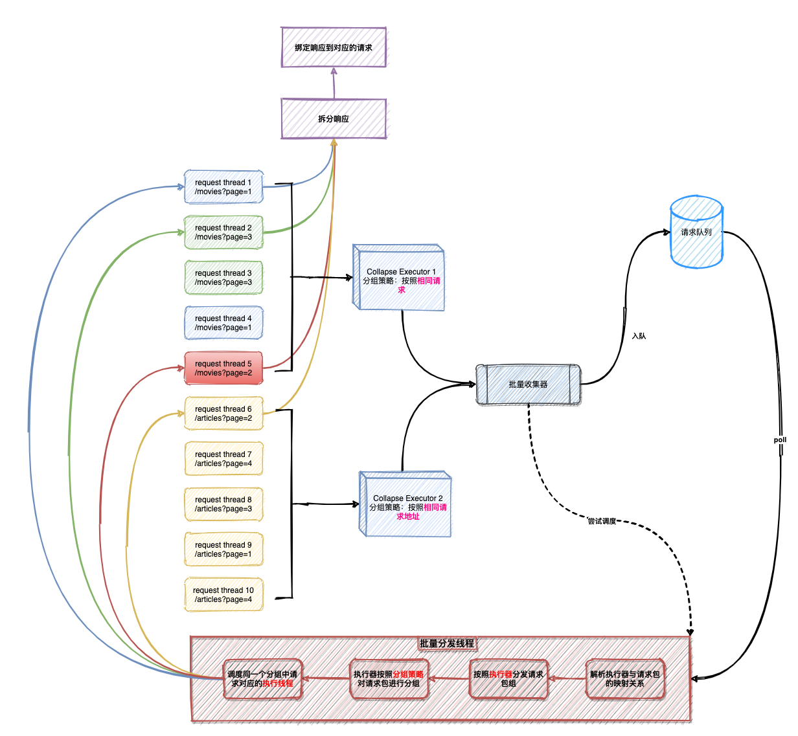

# 简介
collapse executor是一个高性能、低延迟的输入折叠执行器，可以有效支持高并发的热点请求，通过折叠请求的方式减少I/O次数以提高调用性能。

# 流程对比
以下两张图解释了有无折叠执行器的调用差异。当无请求折叠时，请求与网络连接数的比例为1:1；当使用请求折叠后，请求与网络连接数的比例为N:1，即多个请求会合并为一个请求发起远程调用，由此可以做到减少I/O次数、减少后端压力，从而提升调用性能。
### 无请求折叠  


### 有请求折叠


# 优势
1. API简单易上手，扩展难度低
2. 高性能0延迟，发起批量请求时无需等待时间窗口
3. 架构简单，无需维护第三方服务

# 工程结构
## collapse-executor-core 
折叠执行器的核心抽象，包含输入拆分、输出映射、批量采集等核心逻辑抽象
## collapse-executor-integration 
折叠执行器与主流框架的集成模块，如RestTemplate、Servlet Filter等
## collapse-executor-samples 
折叠执行器的使用例子

# 快速开始
`必备条件: JDK8及以上`
## 一.自动折叠及拆分
该方式适用于简单的`幂等请求`的场景，通常需要用户手动指定本次调用所属的并发分组。
> 以下该案例表示将当前传入的Callable按照 `GET http://foobar.com/articles` 进行分组。
> 同一并发分组下的Callable仅执行一次，并将这一次的返回结果作为同一并发分组发起的请求结果
### 1.同步阻塞调用
````java
SingleThreadExecutor singleThreadExecutor = new SingleThreadExecutor();
SuspendableListenableCollector suspendableListeningBundleCollector = new SuspendableListenableCollector(singleThreadExecutor);
BlockingCallableGroupCollapseExecutor blockingCollapseExecutor = new BlockingCallableGroupCollapseExecutor(suspendableListeningBundleCollector);
blockingCollapseExecutor.execute("GET http://foobar.com/articles", () -> {TODO 发起单次请求, 且返回一个响应});
````
### 2.异步调用
````java
SingleThreadExecutor singleThreadExecutor = new SingleThreadExecutor();
SuspendableListenableCollector suspendableListeningBundleCollector = new SuspendableListenableCollector(singleThreadExecutor);
AsyncCallableGroupCollapseExecutor asyncCollapseExecutor = new AsyncCallableGroupCollapseExecutor(suspendableListeningBundleCollector);
asyncCollapseExecutor.setExecutor();//设置异步线程池
CompletableFuture<R> result = asyncCollapseExecutor.execute("GET http://foobar.com/articles", () -> {TODO 发起单次请求, 且返回一个响应});
result.whenComplete();//TODO
````
### 3.非阻塞异步调用
> 这种方式必须保证Callable中的处理逻辑是非阻塞的！
````java
SingleThreadExecutor singleThreadExecutor = new SingleThreadExecutor();
SuspendableListenableCollector suspendableListeningBundleCollector = new SuspendableListenableCollector(singleThreadExecutor);
FutureCallableGroupCollapseExecutor futureCollapseExecutor = new FutureCallableGroupCollapseExecutor(suspendableListeningBundleCollector);
CompletableFuture<R> result = futureCollapseExecutor.execute("GET http://foobar.com/articles", () -> {TODO 发起单次请求, 且返回一个CompletableFuture类型的响应});
result.whenComplete();//TODO
````

## 二.手动折叠及拆分
该方式适用于后端服务提供了批处理接口的场景，将同并发下其他线程的输入合并调用后端服务的批处理接口，可以减少多次不必要的单次调用，如批量查询。  
由于这种方式可以更好的处理输入组，故该方式合并效率可以更高，由此带来的性能提升也会更高。
> TODO

# Servlet合并测试
```` text
服务参数
server.tomcat.threads.max=200

服务地址(位于 collapse-executor-samples 中的 StressTestController, 后端均延迟[100ms]后响应，逻辑一致无差异)
http://localhost:8080/test/collapse100
http://localhost:8080/test/noop100

测试参数
400用户线程数，持续压测5分钟
````

## 开启折叠
```` text
http://localhost:8080/test/collapse100 启用请求折叠测试结果
TPS   3785/s
RT99  115ms
````


## 关闭折叠
```` text
http://localhost:8080/test/noop100 关闭请求折叠测试结果
TPS   1951/s
RT99  211ms
````


# 工作流程
